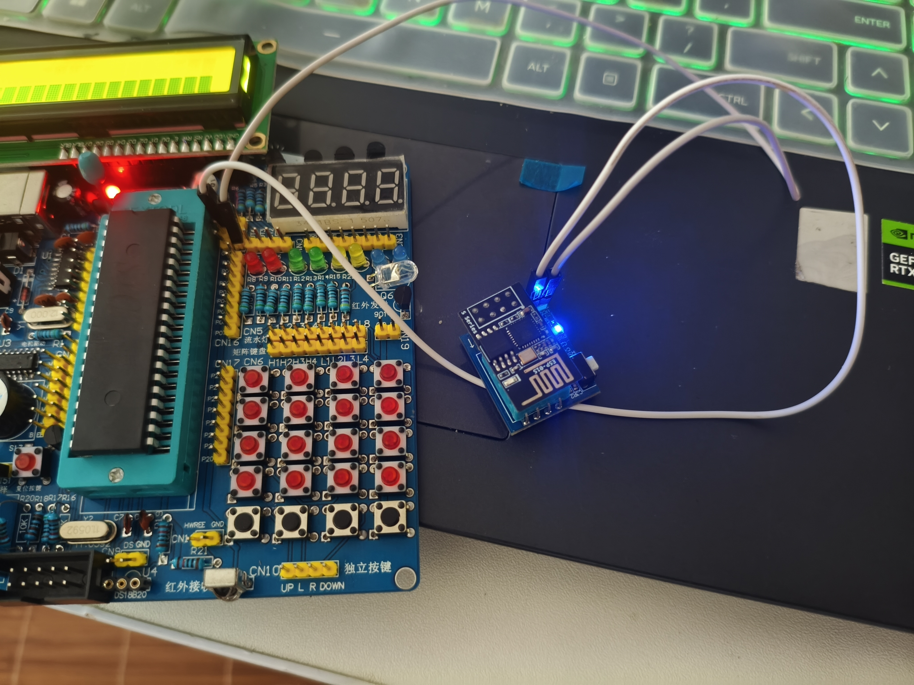

# Relay_MQTT
` Relay_MQTT ` is a simple program that allows you to get temperature and humidity data from the DHT11 sensor and send it to an MQTT server.
### arguments
---
> WIFI_SSID = "WiFi ssid";

> WIFI_PASSWORD = "password";

> MQTT_SERVER_IP = "Server IP"

> MQTT_PORT = 1883;

> MQTT_USER = "Relay";

> MQTT_PASSWORD = "password";

> MQTT_TOPIC = "Topic name";

### features
---
Requires internet connection(_WIFI_) and connection to the MQTT server. 
- Serial baud rate is ` 9600 ` with debug output. 
- Uses ` ESP-01/01S Relay v4.0 relay ` module.
- Supports ` DHT11 ` temperature and humidity sensor.

### MQTT Commands
---
- ` ~GET `: Get temperature and humidity data from the DHT11 sensor.
- ` ~GET_TEMP `: Get temperature data from the DHT11 sensor.
- ` ~GET_HUM `: Get humidity data from the DHT11 sensor.

### Results
--- 

