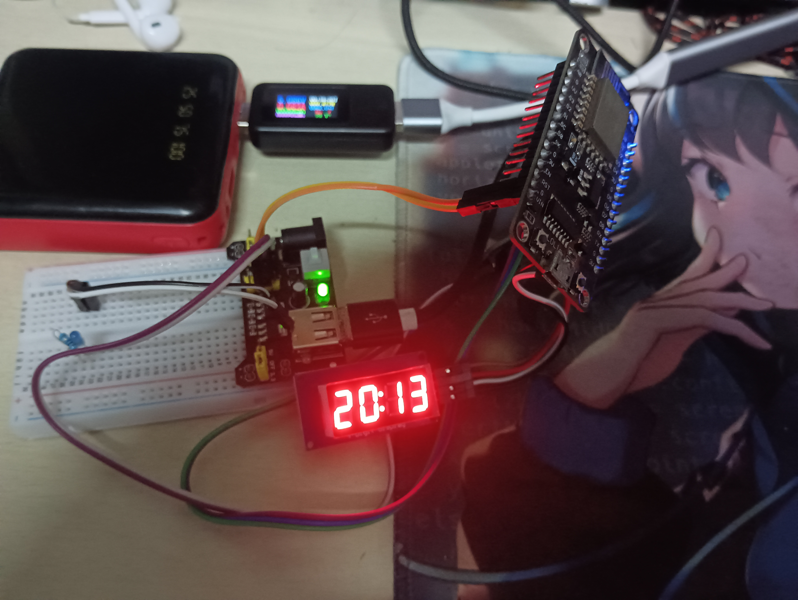

## DS1306 Rtc Clock Module & Tm1637 4 Digit 7 Segment Display Module
### Description:
Debug code on the ESP8266 NodeMCU, with pin definitions marked as constants in the code using ` #define `
--

### Physical photos:
