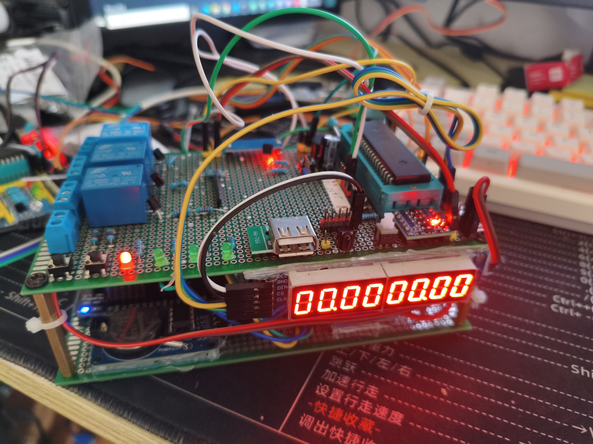

## As you can see There have a gabage
__It looks Like an IED__

## List of other modules referenced
- [DHT11 Node](https://github.com/in-serinder/ArduinoMiscProject/tree/master/DHT11_WiFiNode)
- [51_esp8266RelayOclock](https://github.com/in-serinder/KeilMiscProject) 
- [Gabage_NO.1](https://github.com/in-serinder/ArduinoMiscProject/tree/master/Gabage_NO.1)

### Physical photos:

