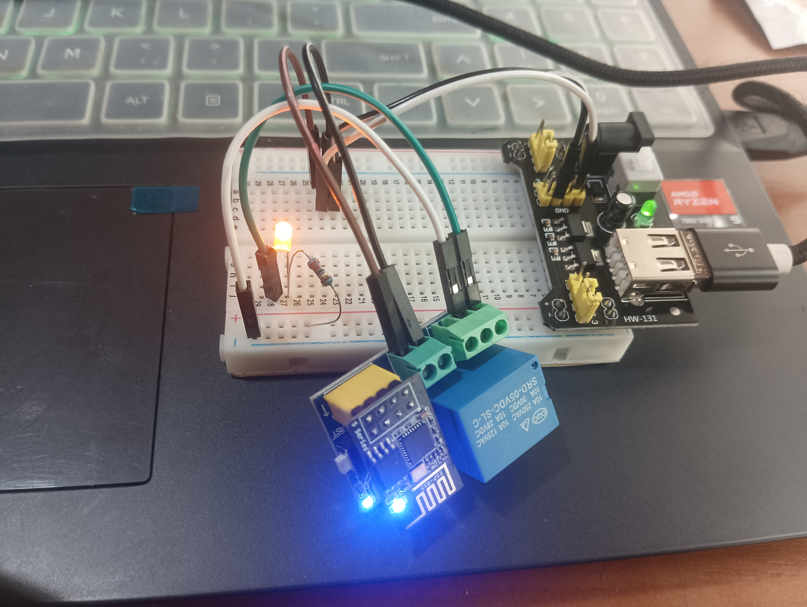

# Relay_MQTT
` Relay_MQTT ` is a simple program that allows you to control a relay through ` MQTT `.
### arguments
---
> WIFI_SSID = "WiFi ssid";

> WIFI_PASSWORD = "password";

> MQTT_SERVER_IP = "Server IP"

> MQTT_PORT = 1883;

> MQTT_USER = "Relay";

> MQTT_PASSWORD = "password";

> MQTT_TOPIC = "Topic name";

### features
---
Requires internet connection(_WIFI_) and connection to the MQTT server. 
- Serial baud rate is ` 9600 ` with debug output. 
- Uses ` ESP-01/01S Relay v4.0 relay ` module.
- ` Normally Open ` & ` Normally Close ` relay types are supported. 
- Relay is controlled through ` MQTT ` protocol.

### MQTT Commands
---
- ` ~status `: Returns the current status of the relay.
- ` ~NO `: Sets the relay to ` Normally Open ` mode. LED is on when the relay is off.
- ` ~NC `: Sets the relay to ` Normally Close ` mode. LED is off when the relay is on.

### Results
--- 

