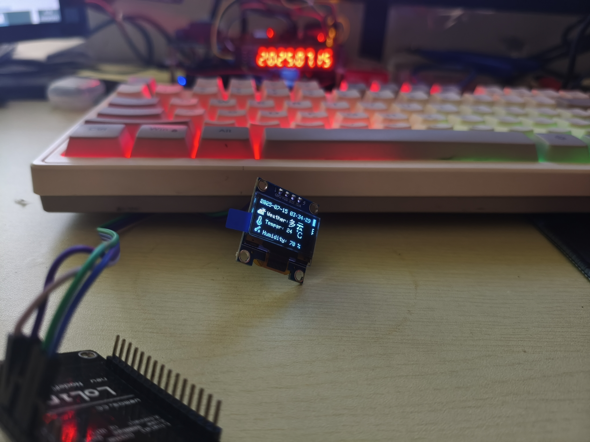
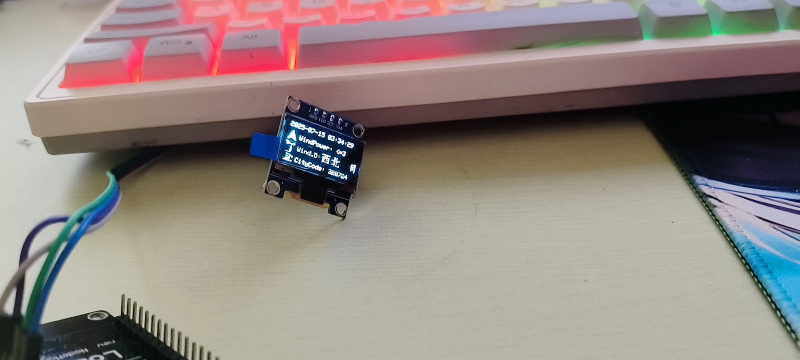
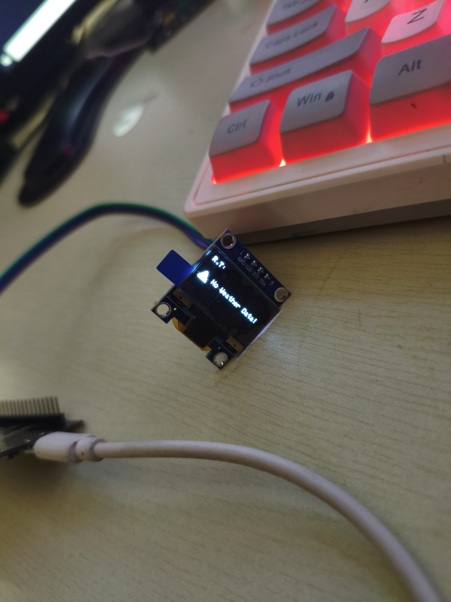

## 基于SSD1306和高德天气API的天气显示器
这是一个使用SSD1306 OLED显示屏和高德天气API来显示当前天气信息的项目。它可以在Arduino或其他兼容平台上运行。 案例基于`ESP8266 Node MCU 12-E `

## 需要内部填写的参数

```
//IIC总线引脚
#define SDA D6
#define SCL D7

#define WEATHERUPDATEHOURSDELAY 3 // 天气更新间隔(小时)


const char *WIFI_SSID = "2.4GHZ"; //WIFI名称
const char *WIFI_PASSWORD = "wifiPWD";

const char *API_REQUESTURL = "http://restapi.amap.com/v3/weather/weatherInfo?";
const char *API_KEY = "APIKEY";
const char *CITY_CODE = "CITYZONECODE";
```

## 定义但未实现内容
- 显示天气状态对应图片


## 展示内容
- 天气报告时间
- 当前气温
- 当前湿度
- 风向
- 风力
- 地区码
## 使用方法
1. 修改代码为自己的参数
2. 上传代码到ESP8266或其它兼容设备
 

## 注意事项
高德API大概半小时更新一次天气数据，`WEATHERUPDATEHOURSDELAY`可以设为`0.5`半小时更新一次，但是一个月个人API只有*5000*次的调用次数


### 实物图片



