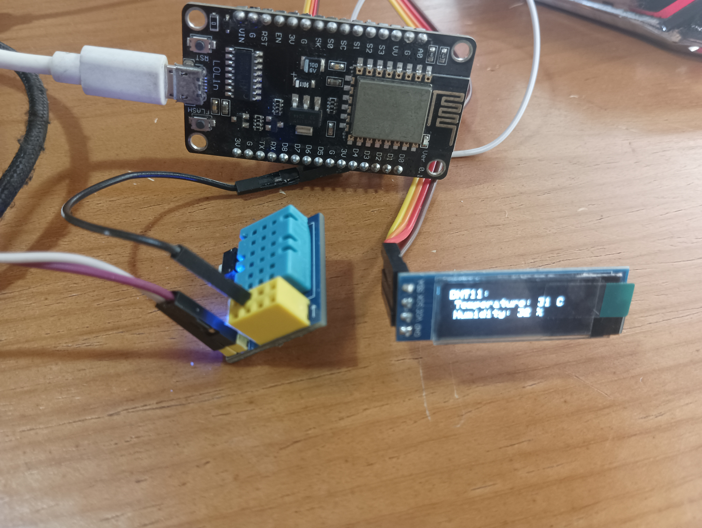

## DHT11 Temperature & Humidity Sensor Module & SSD1306 128x32 OLED Display Module
### Description:
Debug code on the ESP8266 NodeMCU, with pin definitions marked as constants in the code using ` #define `
--

### Physical photos:
